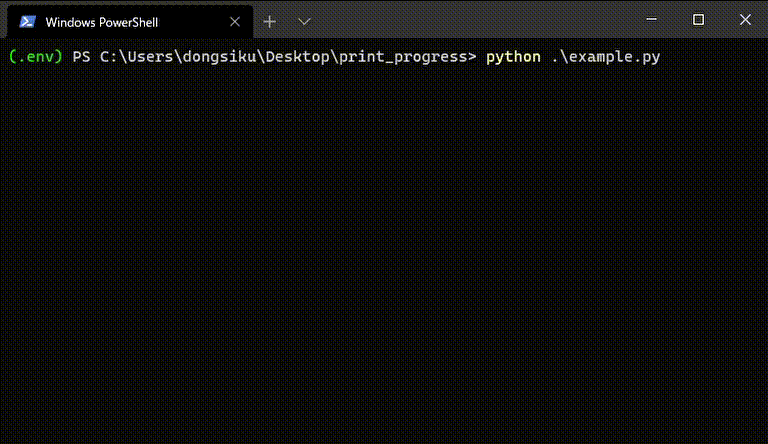

# Print Progress

進捗を表示するパッケージである．

## Installation

```shell-session
pip install -e git+https://github.com/dongsiku/print_progress#egg=print-progress
```

## Example

使用例と動作内容をしめす．

```python
from time import sleep
from print_progress.print_progress import PrintProgress

pp = PrintProgress("Example", 10)  # Create pp
pp.print_start()  # Show start ("Test: ...")
for i in range(10):
    sleep(1)  # YOUR TASK
    pp.print_progress(i + 1)  # Show progress ("Test: 1/10" etc.)
pp.print_completed()  # Show completed ("Test: Completed")
```


